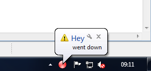

Jay
==========

Jay is a java application skeleton for building a tray traffic light like signalization.

When starting jay reads *.cfg files in your <homedir>/.jay folder. Each config file represents a traffic light bulb. The files are java property files (key/value pair). 

name=Jay

class=jay.monitor.sensor.DummySensor

This bulb would have the label Jay and the class DummySensor would implement the sensor logic. Each sensor runs in it's own deamon thread.

Use jay to build your own monitoring of whatever you want.

Click [here](http://baloise.github.io/jay/jnlp/jay.jnlp) to run the demo.

Some Screenshots
==========

