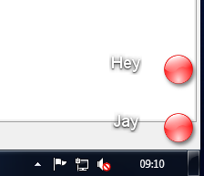
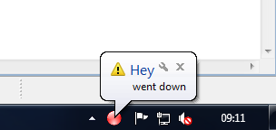

# Jay


Jay is a java application skeleton for building a tray traffic light like signalization.


When starting jay reads *.cfg files in your <homedir>/.jay folder. Each config file represents a traffic light bulb. The files are java property files (key/value pair). 

```
name=Jay
class=jay.monitor.sensor.DummySensor
```

This bulb would have the label Jay and the class DummySensor would implement the sensor logic. Each sensor runs in it's own deamon thread.

Our wiki has documentation of [existing sensors and their configuration](//github.com/baloise/jay/wiki/Sensor-Configuration) as well as [rolling your own sensors](//github.com/baloise/jay/wiki/Create-you-own-sensor).

You can monitoring anything you want easily with Jay.

# Some Screenshots





# Installation on Windows
## Download the binary. 

```
powershell -Command "$proxy = [System.Net.WebRequest]::GetSystemWebProxy();$proxy.Credentials = [System.Net.CredentialCache]::DefaultCredentials;$wc = new-object system.net.WebClient;$wc.proxy = $proxy;$wc.DownloadFile('https://raw.githubusercontent.com/baloise/jay/master/install.bat', 'install_jay.bat');"
install_jay.bat
del install_jay.bat

```
You can look up the current jay version @ https://jitpack.io/com/github/baloise/jay/jay/-SNAPSHOT/maven-metadata.xml

## Create start up item
```
echo powershell -Command Start-Process 'javaw.exe' '-cp "%userprofile%\jay.jar" jay.monitor.Main' -NoNewWindow > "%APPDATA%\Microsoft\Windows\Start Menu\Programs\Startup\jay.bat"
```

## Run
```
powershell -Command Start-Process 'javaw.exe' '-cp "%userprofile%\jay.jar" jay.monitor.Main' -NoNewWindow
```

# Installation on Linux / Mac
## Download the binary. 

```
printf "    __  __  _  _ \n  _(  )/ _\( \/ )\n / \) /    \)  / \n \____\_/\_(__/  \n\n"
wget -O $HOME/.jay/jay.jar https://jitpack.io/com/github/baloise/jay/jay/-SNAPSHOT/jay--SNAPSHOT.jar
```

## Run
```
java -cp $HOME/.jay/jay.jar jay.monitor.Main &
```
